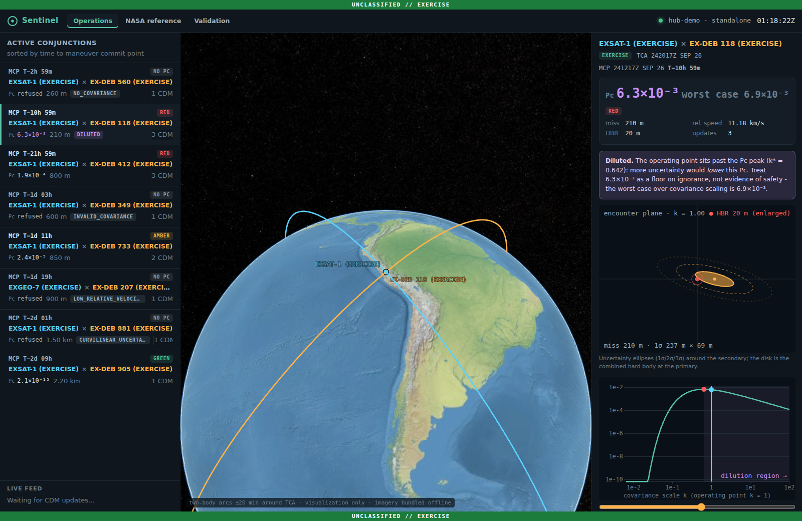
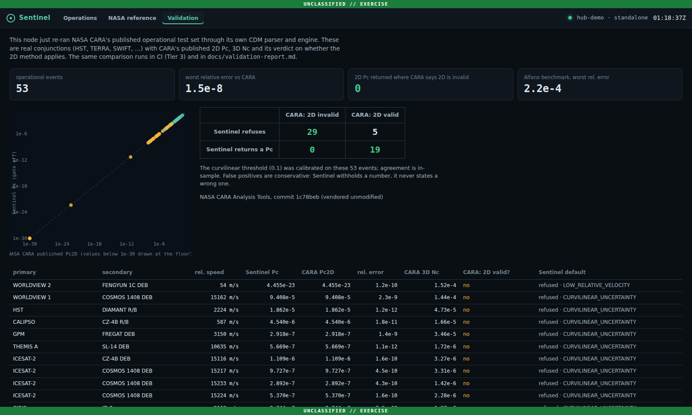
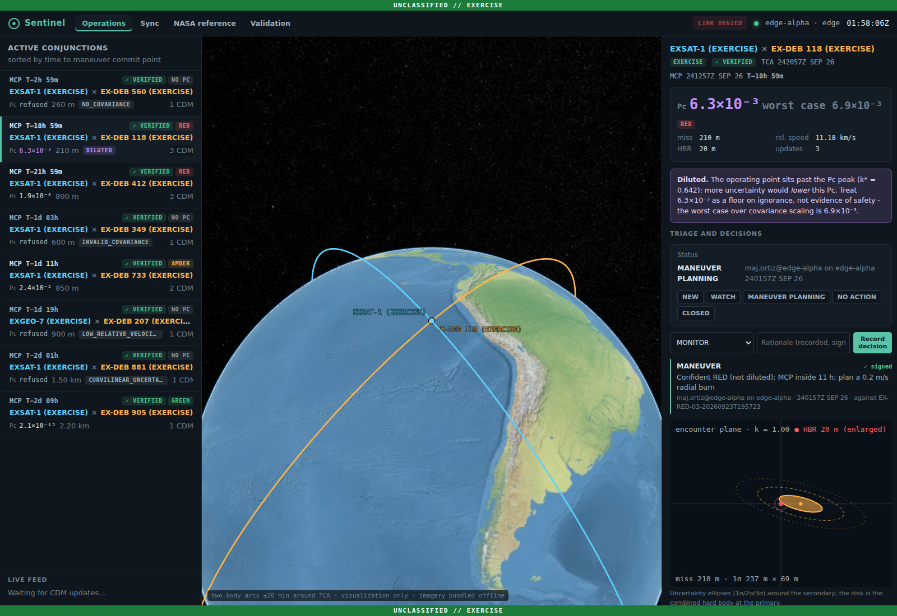
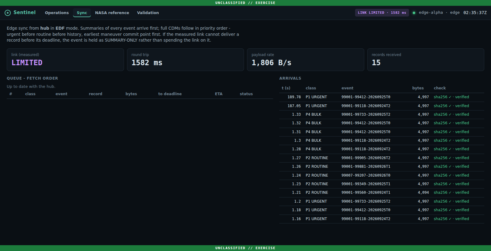
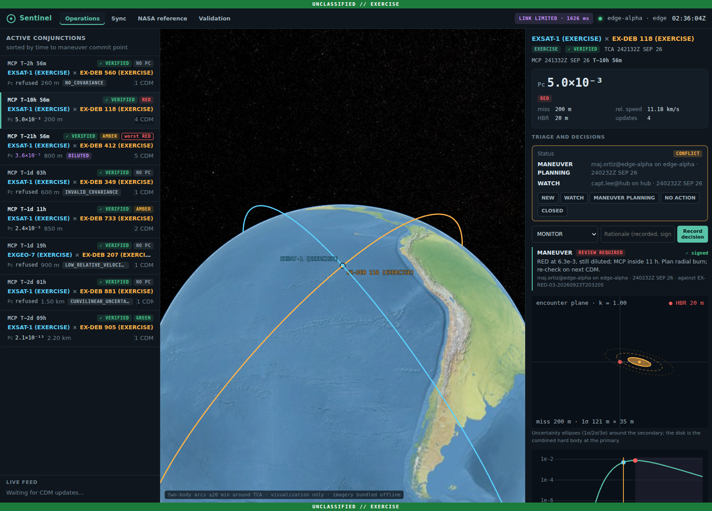
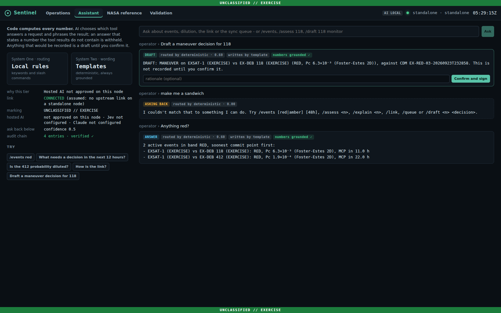
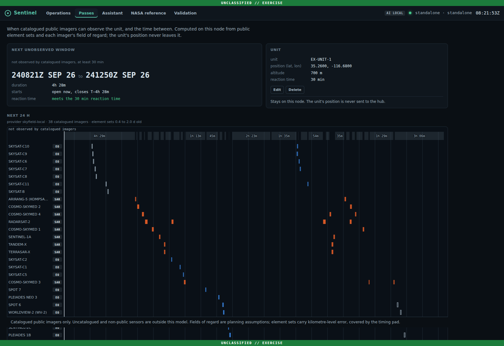

# Sentinel

A DDIL-resilient conjunction assessment decision aid for satellite operators.

**Status: implemented and tested end to end: the risk engine (validated against NASA CARA), the operator console, hub/edge DDIL sync on a real two-node network, the Army overhead-pass module, AI decision support, a signed and offline-verifiable supply chain, a generated OSCAL package (no ATO is claimed) and a SysML v2 requirement trace. Nothing has been fielded.**



---

## What this is

A satellite operator receives warnings that a tracked object may pass close
to one of their assets, and must decide - before the maneuver commit point -
whether to spend propellant avoiding it. Sentinel is a decision aid for that
call, built around three claims.

**Claim one: a low probability of collision is not by itself evidence of safety.**

Collision probability is computed by integrating position uncertainty over
the combined hard-body radius. Past a certain point, *more* uncertainty
produces a *lower* probability - the mass gets smeared thin and less of it
lands on the disk. So a reassuring number can mean either "we know precisely
that these will miss" or "we barely know where either object is."

Sentinel computes where the operating point sits relative to that peak and
says so. Run `uv run python scripts/dilution_demo.py` (set up as in [Running it](#running-it)):

```
 sigma (m)            Pc        Pc max        k*                 verdict
------------------------------------------------------------------------
       100     9.656e-27     3.679e-07    50.000           bounded above
       300     2.148e-08^    3.679e-07     5.556           bounded above
       500     2.707e-07^    3.679e-07     2.000           bounded above
       646     3.614e-07^    3.679e-07     1.200           bounded above
       707     3.679e-07^    3.679e-07     1.000           bounded above
     1,000     3.033e-07v    3.679e-07     0.500  DILUTED - Pc unreliable
     2,041     1.065e-07v    3.679e-07     0.120  DILUTED - Pc unreliable
     5,000     1.960e-08v    3.679e-07     0.020  DILUTED - Pc unreliable
```

Geometry is identical on every row. Only the quality of the orbit solution
changes. The first row and the last row both report a probability below
1e-7; one is a precise measurement and the other is near-total ignorance.

The boundary has a closed form: dilution begins once the 1-sigma uncertainty
exceeds the miss distance over root two.

**Claim two: the tooling assumes connectivity it will not always have.**

Conjunction assessment tooling is overwhelmingly cloud-hosted. An operator
on a deployed ground station, a ship, or any denied or degraded link loses
the decision aid exactly when the decision still has to be made. The commit
point does not move because the network went down. Sentinel keeps every
node working on its own data and moves what matters first when a link
returns: built and measured below (ADR-004 to ADR-006, ADR-008).

**Claim three: AI helps only where it cannot corrupt the decision.**

A language model is good at understanding what an operator is asking and at
phrasing an answer, and unreliable at arithmetic. A decision aid that lets a
model state a collision probability has put an unauditable number in front
of someone deciding whether to burn propellant. Sentinel uses AI to choose
the tool and to phrase the result, never to compute, and it checks that
every number in an AI-written answer came from the validated code (ADR-007).

---

## The operator console

`make serve`, then open http://127.0.0.1:8000. One process serves the API and the console.

- **Operations.** Active conjunctions sorted by time to the maneuver commit point, which is when a decision is due, not when a message arrived. A scripted exercise scenario plays out live: CDM updates arrive on schedule and the list re-ranks as they do.
- **The two plots that carry the argument.** The encounter-plane view and the Pc-vs-covariance-scale curve share one slider. Drag it and the uncertainty ellipse grows past the hard-body disk while Pc climbs, peaks, then *falls*. That is dilution, shown rather than described.
- **Refusals are first-class.** A refused event shows why, the value that tripped the gate, and the threshold. It is never shown as a zero.
- **Provenance on every number.** Inputs hash, engine version, source CDM hash, and the originator's own Pc labelled as theirs.
- **NASA reference.** The 53 CARA operational events, ingested through the same parser.
- **Validation.** The node re-runs the NASA comparison with the engine it is actually running and shows the agreement.

The globe is CesiumJS using imagery bundled with the application, with no ion token, geocoder or CDN. The node serves the console under a `default-src 'self'` Content-Security-Policy (asserted in `tests/api/test_api.py`), so the browser itself blocks any request beyond the node. The console works on a network with no route to the internet, or it is not a field tool.



---

## Disconnected operations: hub and edge

Claim two, built and measured. Each node runs its own `nats-server` and serves its own console. The edge's server holds a leafnode link to the hub. In the harness, [Toxiproxy](https://github.com/Shopify/toxiproxy) shapes that real TCP link: black-hole (DENIED), 600 ms / 32 kB/s (DEGRADED), about 8 kbit/s (LIMITED), and repeated drops (INTERMITTENT).

```bash
make demo-local      # hub :8000, edge :8001 - the edge's LINK chip shapes the real link
make compose-up      # the same hub and edge in containers; only Docker needed (docs/compose.md)
make ddil            # every scenario on real processes -> docs/ddil-results.md
```

**In containers.** `make compose-up` runs the same topology with only Docker needed.
- Each node's `nats-server` and console share a network namespace.
- The edge reaches the hub only through Toxiproxy.
- The NATS configs are rendered from the same templates by the harness's own code, so the leaf permissions and DDIL fixes are identical.

`make compose-link PRESET=DENIED` shapes the link. `make compose-smoke` checks that the edge syncs and verifies the hub's events, keeps answering while DENIED, reconverges, and never lets a unit reach the hub.

The containers themselves have not run yet: the `compose-smoke` CI job is their first real run. The smoke test has passed against the process harness. See `docs/compose.md`.

**Denied: the edge keeps working.** The console stays up (2.8 ms p95 while cut off). Operators triage events and record signed decisions locally, and the link state is *measured*, not configured.



**Limited: what matters crosses first.** The edge gets a summary of every event (at most 256 bytes each) first: within 5.5 s in the latest run. Then full CDMs follow, earliest maneuver commit point first. Each is re-assessed locally and compared with what the hub asserted: an event is HUB-ASSERTED until then, VERIFIED once the local result matches, and MISMATCH if it doesn't. Measured on the same link with the same bytes, the most urgent full record arrives in **12.1 s with earliest-deadline-first vs 46.8 s in FIFO order** (3.9×, latest run in `docs/ddil-results.md`). That run uses the hub's default configuration, which also offers edges the 38 imaging-catalog element sets over the same link. ADR-008 records what reference data costs on a thin link.



**Reconnect: nothing lost, nothing overwritten.** Operator data is a CRDT (property-tested under drop, duplication and reordering):
- the hub and the edge converge to the same state;
- two people who changed the same event's triage status while partitioned see a **CONFLICT** that names both, instead of whoever-wrote-last winning;
- a decision made offline against a CDM that has since been superseded is flagged **REVIEW REQUIRED**.



The harness also found four NATS defaults that assume a LAN. One would have made a satellite-linked edge reconnect forever, and another let the edge silently route around its intended path. They are fixed and each is guarded by a scenario (`docs/system-design.md`, "Findings from the DDIL harness").

---

## AI decision support: Jev routes, code computes, the operator decides

Claim three. The assistant never produces a risk number, and that is enforced rather than promised: `.importlinter` forbids `sentinel/ai` from importing the risk engine, the CDM codec, numpy or scipy.

| Step | Hosted, when policy allows | Always-available floor |
|---|---|---|
| **Route** the request to one catalogued tool | [Jev](https://docs.typesafe.ai) (TypeSafe's System One model). Typed questions whose options are exactly the tool catalog and the events on this node, answered with calibrated probabilities | slash commands and keyword rules |
| **Compute** the facts | none: Sentinel's own validated code | the same |
| **Phrase** the facts | Claude | deterministic templates |

- **The tier follows the measured link and the marking.**
  - Hosted AI needs an UNCLASSIFIED marking and operator opt-in.
  - Jev may run on a LIMITED link, because its answer is a few probabilities, not prose.
  - Claude needs CONNECTED or DEGRADED.
  - DENIED means local only.
  - A failing hosted call falls back within the same answer, and the answer says so.
- **Unsure means ask.** Below 0.5 confidence, or with no event named, the assistant offers the top alternatives as one-click choices.
- **Every number is grounded.** An AI-written answer that states a number the tool results do not contain is withheld. The template answer is shown instead, with the offending number named.
- **Drafts, not actions.** "Draft a maneuver decision for 118" produces a draft. A person confirms it, and it becomes a signed DECISION carrying its provenance (router, confidence, model). A draft made against a CDM that has since been superseded cannot be confirmed.
- **Audited.** Every ask and confirm is a line in a hash-chained log that the console verifies.



**Measured, not claimed.** `make ai-eval` scores the routers on 60 labelled requests through the assistant's own confidence gate, reporting accuracy, coverage, abstention, Brier score, ECE and a reliability diagram (`docs/ai-eval.md`). The deterministic floor routes under half of in-scope requests (0.46) to the right tool, which is the gap a model has to close. Jev's column is filled only by a real run with `TYPESAFE_API_KEY` set; no Jev number in this repository was produced any other way.

```bash
SENTINEL_AI_CLOUD=1 TYPESAFE_API_KEY=... ANTHROPIC_API_KEY=... make serve   # hosted tiers (opt-in)
make ai-eval                                                               # score the routers
```

---

## Overhead passes for a disconnected Army unit

The second mission module. A unit on the ground needs to know when a catalogued imaging satellite can see it, and when none can for long enough to move.

- **What it computes.** Pass windows for 38 public-catalog EO and SAR imagers, from public CelesTrak element sets and each imager's field of regard. Fields of regard are planning assumptions with cited sources, chosen to err wide. EO passes count only when the unit is lit. The next window long enough for the unit's reaction time is shown as a date-time group.
- **What it will not say.** A gap is labelled *not observed by catalogued imagers*, never "safe": uncatalogued and non-public sensors are outside the model, and a test keeps the word out of the module and the console. Element-set error is covered by a timing pad that widens with age, and sets older than three days are flagged stale.
- **Two providers, one contract.** Local SGP4 and a CCSDS OEM ephemeris provider must both pass one conformance suite: rise and set within 2 s of a brute-force oracle. A Wayfinder adapter feeds the second provider, on an *assumed* schema (see `docs/adapters/wayfinder.md`) (ADR-011).
- **The unit's position never leaves the edge (ADR-010).** It is not a sync record, never logged, stored in one 0600 file, and the edge's leaf link denies the subjects that could carry it. The OPSEC harness scenario checks this on real processes: the hub's wire never carries the unit in any checked encoding, and a deliberate canary never crosses. The results are in `docs/ddil-results.md`.
- **Reference data rides the same sync.** Public element sets reach the edge through the unchanged priority agent. The hub offers edges only the imaging catalog, and ADR-008 records what that costs on a thin link.



---

## Supply chain: signed, attested, verifiable offline

A classified or disconnected site has to trust a bundle without reaching the internet to check it.

- **Signing.** Releases are signed keyless with Sigstore from GitHub Actions. They carry SLSA **Build L2** provenance and SPDX SBOM attestations; SPDX and CycloneDX SBOMs ship alongside, covered by the signed checksum list. Build L2 is the honest level; `docs/supply-chain.md` explains why this is not L3.
- **Offline verification.** Every install path verifies the signature against a pinned Sigstore trust root (or a site key) before unpacking anything, with no network. `make airgap-verify` and the Ansible role run the same gate, `deploy/bundle/verify_signature.sh`; the bundle's `install.sh` then checks every file against its `SHA256SUMS`.
- **Local proofs.**
  - `make airgap-selftest` shows that a tampered, unsigned, wrong-key or wrong-identity bundle is refused.
  - `make airgap-local` builds a bundle, signs it with a throwaway key, and installs it inside a network namespace with only loopback. There it reproduces the NASA validation and, as a hub, loads its bundled element sets. The `airgap-install` CI job is configured to repeat this for each architecture.
- **Vulnerability gate.** Scans fail on any finding without a reviewed VEX statement. The one current finding (GO-2026-5932, against the `openpgp` package of a Go module `nats-server` depends on) is shown not to be linked into the binary, and that check re-runs on every scan.

## Traceability, generated

`mbse/` is a SysML v2 textual model of Sentinel: requirements, parts, ports, and the link-state and AI-tier state machines. Every requirement traces to:
- the part that satisfies it;
- the evidence that verifies it: a test, a harness scenario, an import contract or a CI step.

CI regenerates `docs/traceability.md`, and fails on any reference to evidence that does not exist. Work not built yet is marked *planned* and reported as unverified, never as verified. The current trace has 54 requirements: 54 verified, 0 unverified, 0 broken references. A real SysML v2 grammar (sysml2py, the pilot implementation's grammar) parses the model in CI. That check covers syntax, not semantics, and the docs say so.

---

## What is deliberately *not* here

**No probability of collision without covariance.** Element sets alone do not
support a Pc, and the engine refuses rather than producing one. NASA CARA's
position is that two-line elements are not sufficient for conjunction
assessment - kilometre-scale theory error is too large for maneuver planning,
and no covariance is available to compute a probability from. Screening on
element sets and printing a Pc anyway is the most common way to get this
wrong.

What Sentinel does with element sets instead is *demonstration mode*.
`sentinel screen --primary 40115 --hours 24` screens a satellite against the
bundled public CelesTrak snapshot and lists every close approach: object,
time of closest approach, miss distance and relative speed. Every line says
*Pc: refused — element sets have no covariance*. The bundled snapshot is one
small public group, so a 24-hour window at the default 5 km threshold is
often empty ("no close approaches"); widen it with `--threshold-km 50` to see
the listing. With `--out DIR` it writes each approach as a DERIVED CCSDS CDM.
Fed back in, the risk engine refuses it with `NO_COVARIANCE`, the same gate
any covariance-less CDM meets. There is no special case in the engine
(ADR-002).

**No number where the model does not apply.** Low relative velocity breaks
the rectilinear encounter assumption - the geostationary and similar-orbit
case. The engine detects it and refuses with a reason and the value that
tripped the gate, rather than returning something that looks authoritative.
Implementing the 3D numerical method that *would* handle those cases is
deferred; detecting that it is needed is not.

**No Pc where NASA's own reference says the 2D method is wrong.** CARA publishes 53 real operational conjunctions with its verdict on whether the 2D method applies. Sentinel's gate refuses **every one** of the 29 that CARA flags. On those events CARA's 3D result differs from the 2D value by up to 60,722× at orbital speeds, and by up to 162 orders of magnitude at low relative velocity. The threshold was calibrated on that same set, and the validation report states this next to the result.

---

## Validation

`docs/validation-report.md` is generated from two kinds of expected value: closed forms, and numbers NASA CARA published. None comes from running this code.

| check | reference | result |
|---|---|---|
| 53 real operational conjunctions (HST, TERRA, SWIFT, ...) | CARA's published Pc2D | worst relative error **1.5e-8** |
| Gate vs CARA's "2D invalid" verdicts | CARA's `ViolationsPc2D` | **29/29 refused, 0 missed**, 5 conservative refusals |
| Alfano (2009) benchmark, read from CDM files | CARA unit test | all within CARA's rtol 1e-3 |
| Omitron Case 1 | CARA `PcCircle` high-accuracy | 1.9e-8 |
| Omitron Case 2 | CARA `PcCircle` | difference explained to 1e-14 by miss-distance convention |
| Isotropic zero-miss integral | `1 - exp(-R²/2σ²)` | 2.2e-12 |
| Pc-maximising scale factor | `k* = (d²/2)/σ²` | 5.2e-07 |
| Maximum Pc | `Pc_max = R²/(e·d²)` | 4.2e-14 |

The NASA files are vendored **unmodified** under `fixtures/cara/`, with NOSA 1.3 agreements, provenance and SHA-256 checksums verified by the test suite. The quadrature is also cross-checked against `scipy.integrate.dblquad` in Cartesian coordinates (a different algorithm over a different parameterisation) at `rtol=1e-8`.

---

## Running it

```bash
uv sync --locked --python 3.12 --extra dev   # exactly uv.lock, as CI does
uv run pytest -q                      # full ladder, network disabled, 0 skipped
uv run pytest -q -m tier3             # NASA CARA published cases
uv run sentinel assess fixtures/cara/PcTestCaseCDMs/000025994_conj_000037558_20210324_151047_20210323_154356.cdm
uv run python scripts/dilution_demo.py      # the demonstration above
uv run python scripts/validation_report.py  # regenerate docs/validation-report.md
make ai-eval                                # score the assistant's routers -> docs/ai-eval.md
```

The `assess` example is TERRA against a fragment of Iridium 33, a real 2021 event. Sentinel reproduces the originator's Pc of 2.1e-2 and flags it **diluted**: the covariance sits past the Pc peak, and the worst case over covariance scaling is 3.5e-2.

The test suite is organised as the ladder in `docs/risk-engine-design.md`
section 7, each tier a pytest marker:

| tier | what it establishes |
|---|---|
| 1 | frame rotation and encounter-plane geometry, no probability |
| 2 | the collision integral, against closed forms and an independent oracle |
| 3 | agreement with NASA CARA published cases, including the gate against CARA's own verdicts |
| 4 | maximum Pc and dilution detection |
| 5 | the applicability gate - every refusal path |
| 6 | the output contract |

---

## Layout

```
sentinel/cdm/          CCSDS 508.0-B-1 KVN codec and admission policy (ADR-001 seam)
sentinel/risk/         Foster-Estes 2D Pc, TCA refinement, dilution, applicability gate
sentinel/conjunction/  mission module: ingest, events, triage policy, summaries, exercise scenario
sentinel/bus/          Bus protocol: in-process and NATS implementations, node-scoped subjects
sentinel/sync/         priority pull (edge) and manifest/fetch/ops server (hub) - mission-agnostic
sentinel/crdt/         dots, signed decision log, multi-value registers (property-tested)
sentinel/ops/          operator data service: decisions, triage, persistence, anti-entropy
sentinel/triage/       class / deadline / consequence - the only thing sync knows about a mission
sentinel/linkstate/    measured link state; Toxiproxy control for demos and the harness
sentinel/ai/           assistant: tier policy, Jev and local routers, tools, narrators, grounding guard, eval
sentinel/audit/        hash-chained JSON Lines audit log
sentinel/passes/       Army overhead-pass module: imaging catalog, element sets, providers, gaps
sentinel/ephemeris/    CCSDS OEM codec and Earth-fixed state tables
sentinel/adapters/     source adapters (Wayfinder, on an assumed schema - see docs/adapters/)
sentinel/screening/    demonstration mode: element-set close approaches, geometry only (ADR-002)
sentinel/api/          the node: FastAPI, SSE, strict CSP, static console; composes module records for sync
sentinel/validation/   NASA CARA published cases, shared by the Tier 3 tests, the report and the Validation tab
sentinel/obs.py        structured logging: stable messages, values as fields
web/                   React + TypeScript + CesiumJS console (offline imagery, no ion, no CDN)
harness/               real two-node DDIL scenarios (nats-server + Toxiproxy, no containers)
deploy/                offline installer and signature gate, systemd, NATS configs, container, AWS Terraform, Ansible
fixtures/cara/         NASA CARA data, unmodified, with licence, provenance and checksums
fixtures/omm/          public CelesTrak element-set snapshot, with provenance and checksums
supplychain/           build-side tooling: SBOMs, Trivy + VEX, bundle manifests (not shipped)
mbse/                  SysML v2 model and the trace generator -> docs/traceability.md
compliance/            OSCAL generator and sources; generated SSP, assessment results and POA&M (docs/compliance.md)
evals/                 labelled operator requests for the routing eval
docs/                  ADRs, ICDs, supply chain, generated validation / DDIL / AI-eval / trace reports
```

---

## Design documents

The architecture decisions, including the ones rejected and why, are in
`docs/system-design.md`. The rejected alternatives are recorded deliberately:
anyone can choose a message bus, the useful part is being able to say why not
the other one.

- **Engineers:** the [technical guide](docs/technical-guide.md) covers architecture, data flows, the configuration reference and how to extend. [`docs/index.md`](docs/index.md) lists every document, and [`CONTRIBUTING.md`](CONTRIBUTING.md) the rules and checks.
- **Interfaces:** [`docs/icd/`](docs/icd/README.md) has the OpenAPI, AsyncAPI 3.0, CDM admission profile and sync envelope. Each is held to the code by `tests/docs/`.
- **For program offices and operators:**
  - the [white paper](docs/white-paper.md);
  - the [quad chart](docs/quad-chart.md);
  - the [3-minute demo script](docs/demo-script.md);
  - the [disconnected-site install guide](docs/install-guide.md).
- **Security:** [`SECURITY.md`](SECURITY.md) (how to report, and the known open gaps), [`docs/supply-chain.md`](docs/supply-chain.md), [`docs/compliance.md`](docs/compliance.md).
