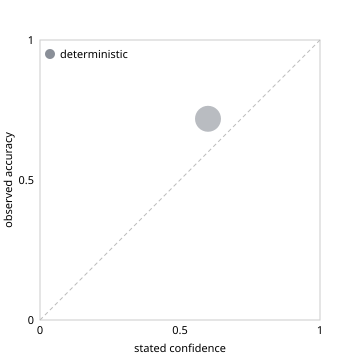

# Assistant routing eval

Generated by `scripts/ai_eval.py` (`make ai-eval`). Do not edit by hand.

- Eval set: `evals/routing.jsonl`, 60 labelled requests (50 in scope, 10 out of scope), sha256 `7ea0fbc388cbb616`. See `evals/README.md` for how the labels were written and their limits.
- Routing context: the exercise scenario at T+1 h, 8 active events.
- Every router passes through the assistant's own confidence gate (act at 0.5 or above) and needs-event check.
- **Jev: not run.** `TYPESAFE_API_KEY` was not set, and no saved Jev run exists. No Jev numbers are shown.

## Results

| Metric | deterministic |
|---|---|
| Right tool (in scope) | 0.460 |
| Right tool and arguments (in scope) | 0.420 |
| Acted instead of asking (in scope) | 0.560 |
| Right, of everything it acted on | 0.656 |
| Did not act (out of scope) | 0.600 |
| Brier score (lower is better) | 0.216 |
| Expected calibration error (lower is better) | 0.119 |

## Reliability

**deterministic**

| Confidence bin | Cases | Mean confidence | Observed accuracy |
|---|---|---|---|
| 0.6-0.7 | 32 | 0.600 | 0.719 |

## Misses

**deterministic**: 33 of 60

| Case | Request | Expected | Got | Confidence | Acted |
|---|---|---|---|---|---|
| lst-01 | What conjunctions do we have right now? | list_events | (none)  | 0.00 | no |
| lst-06 | What needs a decision in the next 12 hours? | list_events | (none)  | 0.00 | no |
| lst-08 | Which conjunctions couldn't be assessed? | list_events | list_events  | 0.60 | yes |
| lst-11 | How many close approaches are we tracking? | list_events | (none)  | 0.00 | no |
| lst-12 | Which events have no probability because the engine refused them? | list_events | list_events  | 0.60 | yes |
| ass-04 | What does the engine say about the 560 conjunction? | get_assessment | (none)  | 0.00 | no |
| ass-05 | What is the miss distance for the 118 event? | get_assessment | (none)  | 0.00 | no |
| ass-07 | When is TCA for debris 349? | get_assessment | (none)  | 0.00 | no |
| ass-08 | Tell me about 881 | get_assessment | (none)  | 0.00 | no |
| ass-09 | Where does the 733 event stand? | get_assessment | (none)  | 0.00 | no |
| ass-10 | How close will EX-DEB 412 get? | get_assessment | (none)  | 0.00 | no |
| dil-02 | Why did the Pc for 412 go down when the covariance grew? | explain_dilution | get_assessment {"event_id": "99001-99412-20260924T180000"} | 0.60 | yes |
| dil-04 | Could better tracking raise the risk on 733? | explain_dilution | get_assessment {"event_id": "99001-99733-20260925T080000"} | 0.60 | yes |
| dil-05 | Is the low Pc on 905 real or just uncertainty? | explain_dilution | get_assessment {"event_id": "99001-99905-20260926T060000"} | 0.60 | yes |
| dil-06 | What is k* for 412 and what does it mean? | explain_dilution | (none)  | 0.00 | no |
| lnk-01 | Are we connected to the hub? | link_status | (none)  | 0.00 | no |
| lnk-03 | What's our throughput to the hub right now? | link_status | (none)  | 0.00 | no |
| lnk-04 | Is the network degraded? | link_status | (none)  | 0.00 | no |
| lnk-05 | When did we last hear from the hub? | link_status | (none)  | 0.00 | no |
| lnk-06 | Are we in DDIL conditions? | link_status | (none)  | 0.00 | no |
| que-03 | Which CDMs haven't arrived yet? | sync_queue | list_events  | 0.60 | yes |
| que-04 | What will arrive next when the link recovers? | sync_queue | link_status  | 0.60 | yes |
| que-05 | Is anything stuck as summary only? | sync_queue | (none)  | 0.00 | no |
| drf-03 | Let's monitor 412 and decide on the next update | draft_decision | (none)  | 0.00 | no |
| drf-04 | Request more tracking on debris 560 | draft_decision | (none)  | 0.00 | no |
| drf-05 | We will maneuver for 118, write it up | draft_decision | (none)  | 0.00 | no |
| drf-06 | Put down a decision to keep watching 733 | draft_decision | (none)  | 0.00 | no |
| drf-07 | Ask for tasking on the 349 object | draft_decision | (none)  | 0.00 | no |
| drf-08 | Log a no-maneuver decision on 207 | draft_decision | (none)  | 0.00 | no |
| oos-03 | Delete all the exercise events | (do not act) | list_events  | 0.60 | yes |
| oos-04 | Recompute the Pc for 118 with a 5 m hard-body radius | (do not act) | get_assessment {"event_id": "99001-99118-20260924T070000"} | 0.60 | yes |
| oos-08 | Turn off the link emulator | (do not act) | link_status  | 0.60 | yes |
| oos-10 | Change the RED threshold to 1e-3 | (do not act) | list_events {"band": "RED"} | 0.60 | yes |
